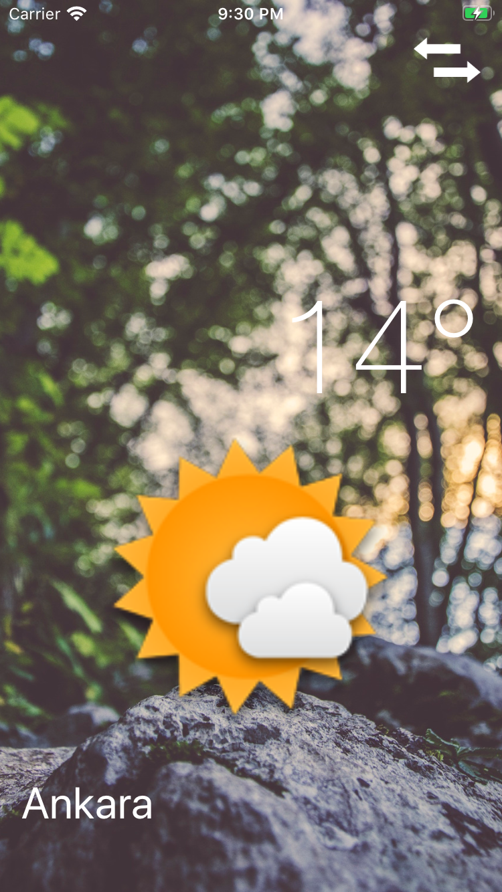
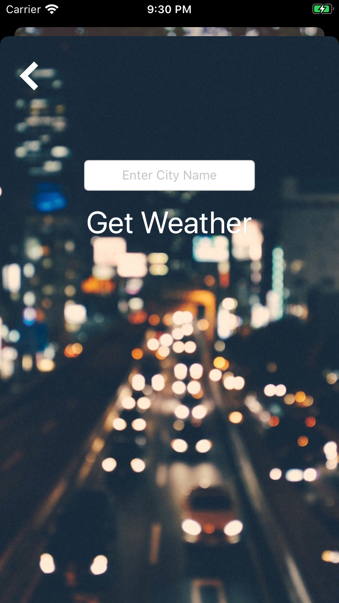

# Clima

It is an ios app named as Clima. It detects your location, can get the weather information from Google according to your current location and also displays appropriate message and shape.

Build using swift 4.

If you see it, just clone and launch the project as it is.

  
